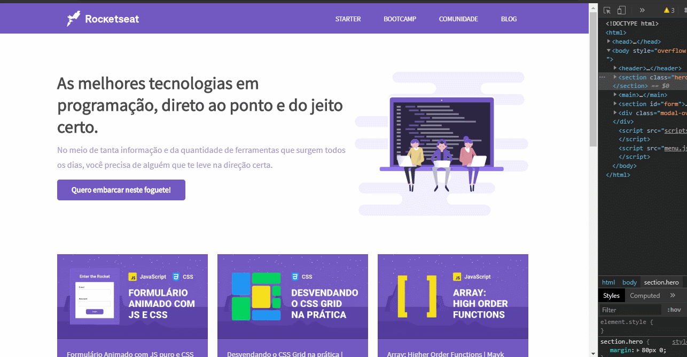

<h1 align="center">Aprendendo responsividade 💻</h1>

💡 Projeto simples para fixar os conceitos e técnicas relacionadas a responsividade, ensinados em uma video aula pelo pessoal da [Rocketseat](https://www.youtube.com/channel/UCSfwM5u0Kce6Cce8_S72olg).

Aqui está o link para a aula que ensina o passo a passo para chegar a esse resultado:

https://www.youtube.com/watch?v=H91DhKPjhPk&list=PL85ITvJ7FLogMzb2s6K5wKpQK2nL76vUK&index=6         